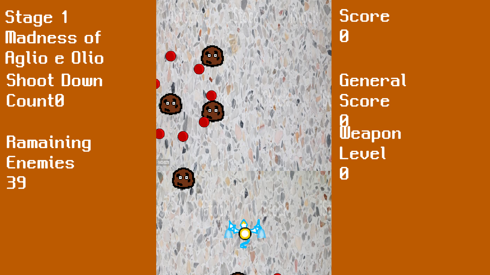

# 사투! 날아다니는 스파게티 괴물 VS 그냥 드라군

[**다운로드 바로가기**](https://drive.google.com/file/d/1S3BWssODedDYCQGG4TrgSA2C_lKms8lC/view?usp=sharing)

드라군을 조종하여 학교를 침략하는 사악한 스파게티 괴물들을 막는 탄막 슈팅 게임입니다.

.png)

 

## 조작 방법

WASD & ↑←↓→ : 드라군 이동
Z : 총알 발사
Shift : 총알 모으기 + 이동 속도 감소

## 게임 요소

### 드라군
플레이어 캐릭터인 드래곤 입니다.
미트볼이나 미트볼이 발사한 페퍼로니에 피격당할 시 생명이 하나 줄어듭니다.

### ATK
드라군의 공격력입니다.
미트볼을 잡으면 랜덤하게 나오는 파워업 아이템을 얻어 강화됩니다.

### 미트볼
기본적으로 나오는 잡몹입니다.
화면의 절반까지 내려와 페퍼로니를 발사하는 공격을 합니다.

### 날아다니는 스파게티 괴물
본 작의 보스역할을 맡는 몬스터입니다.
미트볼들을 모두 잡으면 등장하며, 총 5개의 스테이지마다 각기 다른 2개 이상의 패턴이 구성되어 있습니다.

 
